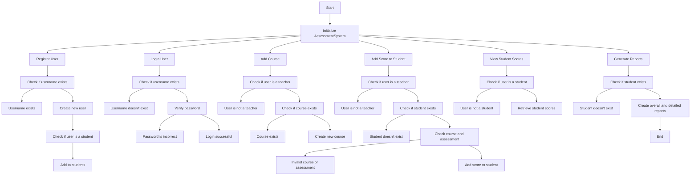

# Assessment Management System

## Overview
The Assessment Management System is designed to manage and track student assessment results for an international college. The system provides functionalities for user registration, login, course addition, score management, and report generation.

## Features

### User Registration
- Allows both students and teachers to register with a unique username and password.
- Automatically categorizes users as either a student or a teacher based on registration details.

### User Login
- Users can log in using their registered username and password.
- Ensures data security by verifying user credentials before granting access.

### Course Management
- Teachers can add new courses along with their respective assessments.
- Each course can have multiple assessments.

### Score Management
- Teachers can add scores for students based on their assessments.
- Scores can be added for individual assessments as well as combined totals for their courses.

### Report Generation
- Provides two types of reports:
  1. Overall Performance Report: Shows the average score of a student across all assessments in a course.
  2. Detailed Course Report: Provides a breakdown of scores for each assessment in a course.

## Algorithm

The flow of operations within the `AssessmentSystem` class is visualized using the following Mermaid diagram:




```


## Run Locally

Run the script in your Python environment. The program will guide you through the registration process.

```bash
  python Testmile.py
```


## Badges

[](https://choosealicense.com/licenses/mit/)

