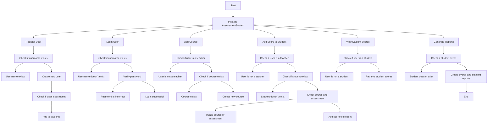

# Python Registration Program

This Python program allows a user to set up a username and password with certain requirements. It serves as a basic example of how a registration system might be implemented.


## Features
- Username input: Allows the user to set their desired username.
- Password input: Allows the user to set their password, ensuring  it's at least 12 characters long.
- Password verification: Asks the user to re-enter their password, verifying they know it, and provides opportunity for correction in case of mismatch.


## Algoritm




## Usage/Examples


Run the script in your Python environment. The program will guide you through the registration process.

```Python
while True:
    username = input("Enter username: ")
    password = input("Enter password: ")

    if len(password) < 12:  # Check password length
        print("Password must be at least 12 characters. Please try again.")
        continue  # Return to start of loop

    password_check = input("Re-enter your password: ")

    if password == password_check:  # Check password match
        print("Registration successful.")
        break
    else:
        print("Passwords do not match. Please try again.")
```


## Run Locally

Run the script in your Python environment. The program will guide you through the registration process.

```bash
  python Testmile.py
```


## Badges

[](https://choosealicense.com/licenses/mit/)

